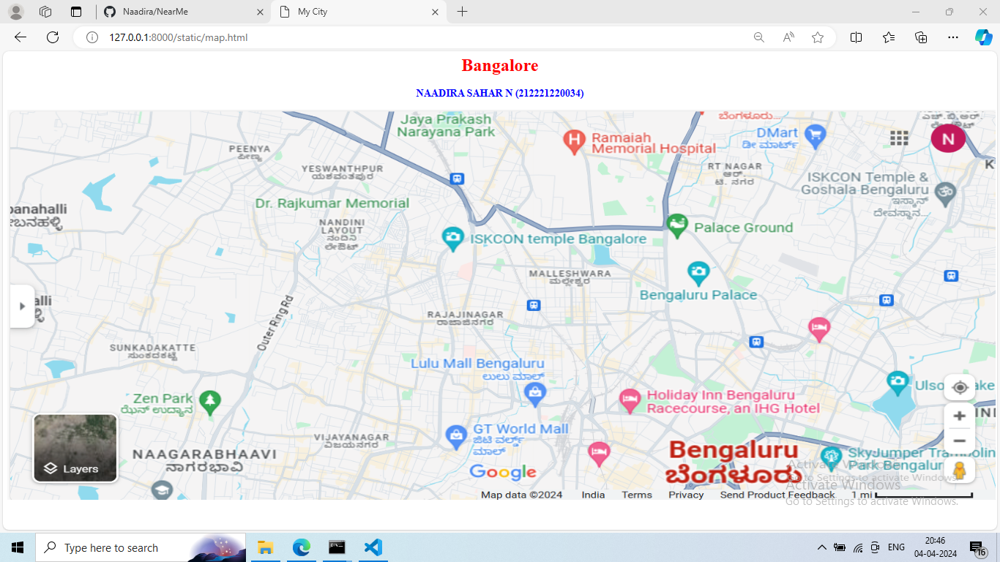
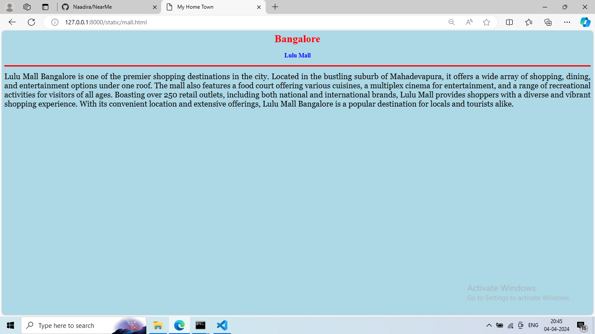
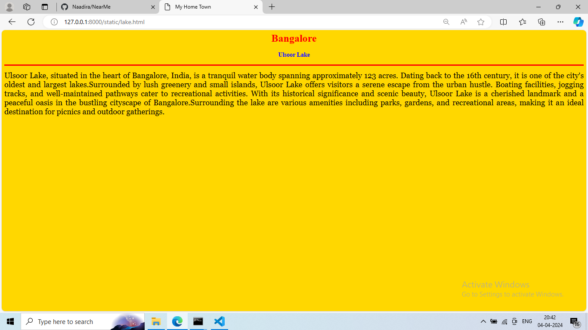
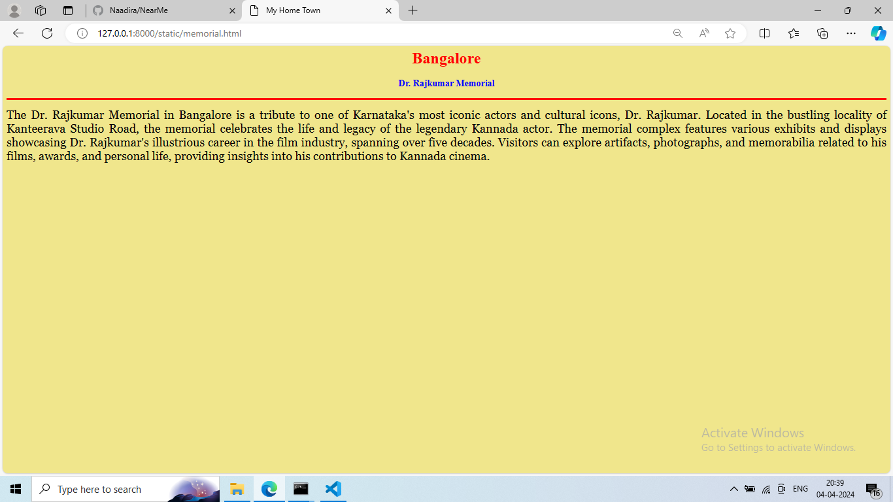
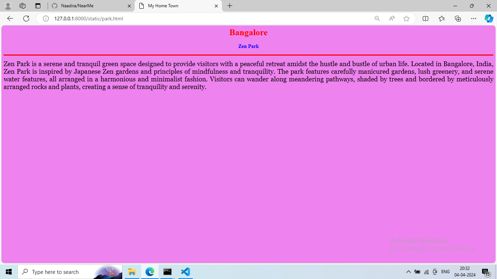
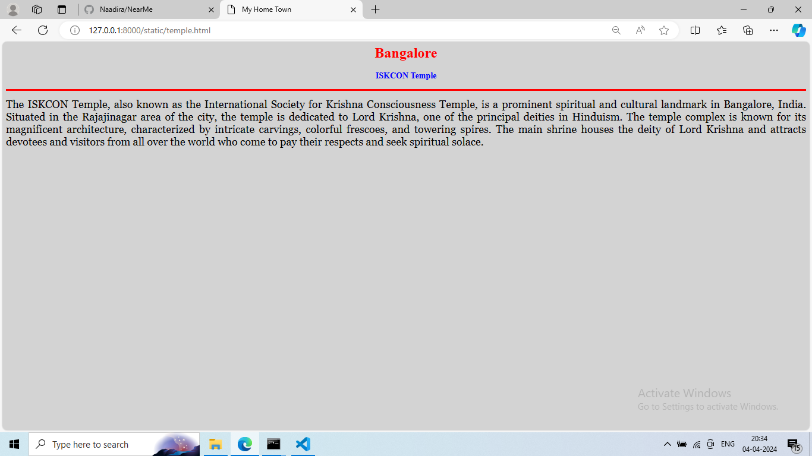

# Ex04 Places Around Me
## Date: 04/04/2024

## AIM:
To develop a website to display details about the places around my house.

## DESIGN STEPS:

### STEP 1
Create a Django admin interface.

### STEP 2
Download your city map from Google.

### STEP 3
Using ```<map>``` tag name the map.

### STEP 4
Create clickable regions in the image using ```<area>``` tag.

### STEP 5
Write HTML programs for all the regions identified.

### STEP 6
Execute the programs and publish them.

## CODE:
```
map.html

<html>
<head>
<title>My City</title>
</head>
<body>
<h1 align="center">
<font color="red"><b>Bangalore</b></font>
</h1>
<h3 align="center">
<font color="blue"><b>NAADIRA SAHAR N (212221220034) </b></font>
</h3>
<center>

<map name="MyCity">
<area shape="rect" coords="700,450,900,500" href="mall.html" title="Lulu Mall">
<area shape="rect" coords="500,400,600,300" href="lake.html" title="Ulsoor Lake">
<area shape="rect" coords="800,150,25,25" href="memorial.html" title="Dr. Rajkumar Memorial">
<area shape="rect" coords="50,100,500,360" href="park.html" title="Zen Park">
<area shape="rect" coords="70,200,800,700" href="temple.html" title="ISKCON Temple">
</map>
</center>
</body>
</html>

mall.html

<html>
<head>
<title>My Home Town</title>
</head>
<body bgcolor="lightblue">
<h1 align="center">
<font color="red"><b>Bangalore</b></font>
</h1>
<h3 align="center">
<font color="blue"><b>Lulu Mall</b></font>
</h3>
<hr size="3" color="red">
<p align="justify">
<font face="Georgia" size="5">
Lulu Mall Bangalore is one of the premier shopping destinations in the city. Located in the bustling suburb of Mahadevapura, it offers a wide array of shopping, dining, and entertainment options under one roof. 
The mall also features a food court offering various cuisines, a multiplex cinema for entertainment, and a range of recreational activities for visitors of all ages.
Boasting over 250 retail outlets, including both national and international brands, Lulu Mall provides shoppers with a diverse and vibrant shopping experience. With its convenient location and extensive offerings, Lulu Mall Bangalore is a popular destination for locals and tourists alike.
</font>
</p>
</body>
</html>

lake.html

<html>
<head>
<title>My Home Town</title>
</head>
<body bgcolor="gold">
<h1 align="center">
<font color="red"><b>Bangalore</b></font>
</h1>
<h3 align="center">
<font color="blue"><b>Ulsoor Lake</b></font>
</h3>
<hr size="3" color="red">
<p align="justify">
<font face="Georgia" size="5">
Ulsoor Lake, situated in the heart of Bangalore, India, is a tranquil water body spanning approximately 123 acres. Dating back to the 16th century, it is one of the city's oldest and largest lakes.Surrounded by lush greenery and small islands, Ulsoor Lake offers visitors a serene escape from the urban hustle. Boating facilities, jogging tracks, and well-maintained pathways cater to recreational activities. 
With its historical significance and scenic beauty, Ulsoor Lake is a cherished landmark and a peaceful oasis in the bustling cityscape of Bangalore.Surrounding the lake are various amenities including parks, gardens, and recreational areas, making it an ideal destination for picnics and outdoor gatherings. 
</font>
</p>
</body>
</html>

memorial.html

<html>
<head>
<title>My Home Town</title>
</head>
<body bgcolor="khaki">
<h1 align="center">
<font color="red"><b>Bangalore</b></font>
</h1>
<h3 align="center">
<font color="blue"><b>Dr. Rajkumar Memorial</b></font>
</h3>
<hr size="3" color="red">
<p align="justify">
<font face="Georgia" size="5">
The Dr. Rajkumar Memorial in Bangalore is a tribute to one of Karnataka's most iconic actors and cultural icons, Dr. Rajkumar. Located in the bustling locality of Kanteerava Studio Road, the memorial celebrates the life and legacy of the legendary Kannada actor.
The memorial complex features various exhibits and displays showcasing Dr. Rajkumar's illustrious career in the film industry, spanning over five decades. Visitors can explore artifacts, photographs, and memorabilia related to his films, awards, and personal life, providing insights into his contributions to Kannada cinema.
</font>
</p>
</body>
</html>

park.html

<html>
<head>
<title>My Home Town</title>
</head>
<body bgcolor="violet">
<h1 align="center">
<font color="red"><b>Bangalore</b></font>
</h1>
<h3 align="center">
<font color="blue"><b>Zen Park</b></font>
</h3>
<hr size="3" color="red">
<p align="justify">
<font face="Georgia" size="5">
Zen Park is a serene and tranquil green space designed to provide visitors with a peaceful retreat amidst the hustle and bustle of urban life. Located in Bangalore, India, Zen Park is inspired by Japanese Zen gardens and principles of mindfulness and tranquility.
The park features carefully manicured gardens, lush greenery, and serene water features, all arranged in a harmonious and minimalist fashion. Visitors can wander along meandering pathways, shaded by trees and bordered by meticulously arranged rocks and plants, creating a sense of tranquility and serenity.
</font>
</p>
</body>
</html>

temple.html

<html>
<head>
<title>My Home Town</title>
</head>
<body bgcolor="lightgray">
<h1 align="center">
<font color="red"><b>Bangalore</b></font>
</h1>
<h3 align="center">
<font color="blue"><b>ISKCON Temple</b></font>
</h3>
<hr size="3" color="red">
<p align="justify">
<font face="Georgia" size="5">
The ISKCON Temple, also known as the International Society for Krishna Consciousness Temple, is a prominent spiritual and cultural landmark in Bangalore, India. Situated in the Rajajinagar area of the city, the temple is dedicated to Lord Krishna, one of the principal deities in Hinduism.
The temple complex is known for its magnificent architecture, characterized by intricate carvings, colorful frescoes, and towering spires. The main shrine houses the deity of Lord Krishna and attracts devotees and visitors from all over the world who come to pay their respects and seek spiritual solace.
</font>
</p>
</body>
</html>
```

## OUTPUT:







## RESULT:
The program for implementing image maps using HTML is executed successfully.
